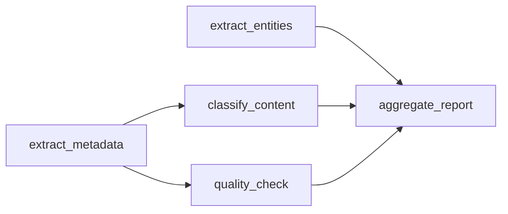

# Helix: An Execution Engine for AI Workloads

[](pyproject.toml)
[](tests/)
[](helix/cli/)

Helix is "Bazel for LLM workloads": it tracks dependencies, stores intermediate computations, recomputes only what changed, and optimizes execution across model calls.

Helix is not a pipeline builder, prompt chaining tool, or agent framework. It is a runtime optimization layer for AI systems.

## Why Helix Exists

Most LLM systems execute like scripts:

- every request recomputes the entire AI workload
- small input changes invalidate more work than necessary
- downstream prompts carry unused context
- repeated or near-duplicate work still calls the model
- independent branches execute sequentially

That execution model becomes expensive as usage grows. Better models can reduce the number of reasoning steps, but production traffic still creates repeated computation, cacheable dependencies, and avoidable latency. Helix wins by eliminating redundant computation at the execution layer.

## What Helix Does

Helix turns YAML-defined AI workloads into execution graphs:

1. Parse the workload into execution nodes and dependencies.
2. Resolve each node input exactly as it will be sent to the backend.
3. Hash resolved inputs, model identity, and relevant config.
4. Reuse unchanged computations from the computation store.
5. Recompute only invalidated nodes.
6. Minimize dependency context before provider calls.
7. Optionally reuse semantically similar computations.
8. Optionally schedule independent nodes concurrently.

The core rule is simple:

```text
IF node input hash unchanged -> reuse previous output
ELSE -> recompute node and update downstream invalidation boundaries
```

This is incremental computation for LLM-based systems.

## Real Benchmark

Recent real OpenAI execution benchmark:

```text
Calls:    10 -> 2
Latency:  14.31s -> 2.32s
Cost:    $0.000358 -> $0.000042
Tokens:   1260 -> 115
```

Those savings come from multiple execution-layer mechanisms:

- call avoidance through exact computation reuse
- narrower recomputation boundaries when inputs change
- context minimization through projection and field slicing
- approximate reuse through semantic embeddings
- lower wall-clock latency through parallel execution where the dependency graph allows it

Observed ranges depend heavily on workload structure. Realistic multi-node workloads commonly show 30-70% latency reduction and 40-80% cost reduction when there is meaningful reuse. Unique single-pass workloads should not be expected to improve much.

## Execution Model

Helix execution is a dependency graph:



Each execution node has:

- dependencies
- resolved inputs
- model/backend config
- versioned output
- exact cache key
- optional semantic embedding

Dependency invalidation is deterministic. If an upstream output changes, only nodes whose resolved inputs change are recomputed. Projection narrows invalidation further: a node that only references `doc_type` and `region` is not invalidated by unrelated fields in the same upstream JSON output.

Semantic reuse is approximate reuse. It is opt-in per node and guarded by a similarity threshold plus review mode settings.

## Computation Store

Helix treats cache as a first-class computation store.

Exact cache:

- hash-based
- keyed by finalized resolved input, model, and relevant execution config
- correctness-first

Semantic cache:

- embedding-based
- stores minimized input text, embedding vector, output, model, and timestamp
- enabled only for nodes marked `semantic_reuse: true`
- uses cosine similarity and a configurable threshold

Cache correctness is prioritized over aggressiveness. Helix does not assume cross-workload reuse unless the resolved computation matches or semantic reuse is explicitly enabled.

## Cache Invalidation Strategy

Cache keys are derived from fully resolved node inputs after projection and context minimization decisions are applied. This means the key represents the actual computation sent to the model.

Invalidation behavior:

- changed referenced input -> affected node recomputes
- unchanged referenced input -> node can reuse
- changed unrelated branch -> unaffected nodes keep their cache entries
- selected dependency fields narrow the invalidation boundary
- semantic reuse is separate from exact invalidation and must be opted in

This lets Helix recompute the smallest deterministic subgraph rather than the entire AI workload.

## Execution Backends

Helix treats models as interchangeable execution units. The optimizer is independent of generation quality; it optimizes which computations need to happen, not what the model should say.

Supported backends:

```bash
helix bench workflows/incremental_execution_demo.yaml --real --backend openai --isolated
helix bench workflows/incremental_execution_demo.yaml --real --backend anthropic --isolated
```

Environment variables:

```bash
export OPENAI_API_KEY=...
export ANTHROPIC_API_KEY=...
```

If API keys are missing, real benchmarks skip with a clear message. The fake backend remains deterministic and requires no API keys.

## Execution Modes

Baseline:

- executes every node
- no optimization
- used as a comparison point

Optimized:

- exact computation reuse
- partial recomputation
- context minimization
- structured output validation

Parallel:

- enabled with `--parallel`
- schedules independent ready nodes concurrently
- reports critical path latency and speedup

Semantic-enabled:

- enabled per execution node with `semantic_reuse: true`
- uses embedding similarity for approximate reuse
- review mode defaults to non-interactive `auto_accept`

Semantic review can be controlled with:

```bash
export HELIX_SEMANTIC_REVIEW_MODE=auto_accept
helix bench workflows/semantic_execution_demo.yaml --semantic-review auto_reject
```

Supported values are `auto_accept`, `auto_reject`, and `interactive`.

## Quickstart

```bash
python -m venv venv
source venv/bin/activate
pip install -e ".[dev]"

helix --help
helix --version
```

Run a deterministic local benchmark:

```bash
helix bench workflows/incremental_execution_demo.yaml
```

Run a real OpenAI execution benchmark:

```bash
export OPENAI_API_KEY=...
helix bench workflows/incremental_execution_demo.yaml --real --backend openai --isolated
```

Show the execution graph and node decisions:

```bash
helix bench workflows/parallel_execution_demo.yaml --parallel --show-graph
```

Write a machine-readable artifact:

```bash
helix bench workflows/incremental_execution_demo.yaml --json-out results.json
```

## CLI Report

Default output is concise and CI-friendly:

```text
=== HELIX REPORT ===

Model: gpt-4o-mini

Latency:   14.31s -> 2.32s  (-83.8%)
Cost:      $0.000358 -> $0.000042  (-88.3%)
Tokens:    1260 -> 115  (-90.9%)
Calls:     10 -> 2

Computation store:
- exact hits: 6
- semantic hits: 1
- invalidations: hash-based
- reuse rate: 80.0%

Execution metrics:
- compute avoided: 1145 tokens
- recomputation ratio: 20.0%
- dependency reuse ratio: 80.0%
- critical path latency: 2.32s
- parallel efficiency: 1.00
```

Use `--verbose` for the full per-node table, context minimization details, structured output repair metrics, and warnings.

## Demo AI Workloads

The `workflows/` directory contains small but focused execution graphs:

- `incremental_execution_demo.yaml`: partial recomputation and projection-based invalidation narrowing
- `semantic_execution_demo.yaml`: embedding-based approximate reuse
- `parallel_execution_demo.yaml`: independent execution nodes scheduled with `--parallel`
- `demo_execution_engine_showcase.yaml`: flagship workload combining incremental recomputation, semantic reuse, context minimization, and parallel scheduling
- `demo_realistic_pipeline.yaml`: production-like document workload for credibility testing
- `demo_low_reuse.yaml`: failure case where inputs are unique and reuse is limited
- `demo_minimization_regression.yaml`: failure case where tiny prompts can make minimization overhead visible

Legacy demo names such as `demo_real_partial.yaml`, `demo_semantic_reuse.yaml`, and `demo_parallel_pipeline.yaml` remain available for compatibility.

## Graph Visibility

Use `--show-graph` to inspect the workload as an execution graph:

```text
Execution graph:
roots: extract_metadata, extract_risks
extract_metadata -> aggregate_report
extract_risks -> aggregate_report

Parallel groups:
[extract_metadata, extract_risks]
[aggregate_report]

Node decisions:
- extract_metadata: EXECUTE
- extract_risks: CACHE_HIT
- aggregate_report: EXECUTE
```

This is useful when validating invalidation boundaries or checking that independent nodes are available for parallel scheduling.

## Context Minimization

Helix reduces prompt tokens by sending each execution node only the dependency fields it needs.

YAML projection:

```yaml
depends_on:
  - extract_metadata

input_projection:
  extract_metadata:
    fields: ["doc_type", "region"]

messages:
  - role: user
    content: "Route {extract_metadata.output.doc_type} in {extract_metadata.output.region}"
```

`{step.output}` injects a full dependency output. `{step.output.field}` injects only the selected JSON field. This makes cache keys smaller and invalidation more precise.

The report separates:

- raw input tokens
- projected input tokens
- optimization overhead tokens
- final minimized input tokens
- net tokens saved by minimization

Helix does not claim context minimization savings when the optimized prompt is larger than the raw prompt.

## Semantic Reuse

Semantic reuse lets Helix avoid calls when two inputs are meaningfully similar but not exact string matches.

Example:

```yaml
- step_id: summarize_invoice
  step_type: llm_call
  semantic_reuse: true
  semantic_threshold: 0.90
```

Threshold tradeoff:

- higher threshold: safer, fewer reuses
- lower threshold: more reuse, higher false-positive risk

Review modes:

- `auto_accept`: default, reuse automatically above threshold
- `auto_reject`: compute similarity but always recompute
- `interactive`: prompt for human approval

Disable semantic reuse by omitting `semantic_reuse: true` from sensitive execution nodes.

## Structured Outputs

Execution nodes can request compact JSON and validate it against a JSON Schema subset:

```yaml
output_format: json
output_schema:
  type: object
  properties:
    doc_type: {type: string}
    region: {type: string}
  required: ["doc_type", "region"]
```

If a model returns invalid JSON, Helix performs one schema-aware repair attempt. If repair fails, the node is marked failed without crashing the entire execution.

## When Helix Works Well

Helix is strongest for:

- repeated or similar inputs
- multi-node AI workloads with shared dependencies
- document processing systems with stable metadata and changing details
- agent-style systems where only part of the state changes
- workloads with large context passing between nodes
- DAGs with independent branches

## When Helix Does Not Help

Helix is less useful for:

- single-call tasks
- fully unique inputs with no reuse
- very small prompts where optimization overhead dominates
- workflows where every node depends on the entire prior output
- highly dynamic prompts that intentionally change every execution

Failure-case workflows are included so the benchmark suite shows these limits directly.

## Repository Structure

```text
helix/
  api_clients/            provider and fake backend clients
  benchmark_engine/       baseline vs optimized measurement and reporting
  cache_engine/           exact and semantic computation store
  cli/                    helix command-line interface
  context_engine/         context snapshots and KV simulation
  execution_optimizer/    cache lookup, reuse, projection, and planning decisions
  workflow/               YAML parsing and workload execution

workflows/                demo execution graphs
benchmarks/               local benchmark scripts
tests/                    unit and integration tests
docs/                     architecture and quickstart notes
```

## Development

```bash
pip install -e ".[dev]"
pytest tests/ -x -q
ruff check helix/ tests/ benchmarks/
mypy helix/ --ignore-missing-imports
```

## Limitations

- Semantic reuse requires threshold tuning.
- Embeddings add a small amount of latency and cost when provider embeddings are used.
- Approximate reuse can be unsafe for domain-sensitive computations without review.
- Parallel speedup is limited by provider latency, rate limits, and dependency graph shape.
- Helix does not expose provider KV cache controls directly.
- Distributed execution is not implemented yet.

## Roadmap

Future work is framed as execution optimization layers:

- Phase 6: evaluator-optimizer loops for quality/cost tradeoff selection
- Phase 7: LangGraph and LangChain adapters for existing AI workloads
- Phase 8: distributed execution and remote computation stores
- Later: semantic diffing, embedding-index backends, and policy-driven reuse controls

Helix's thesis is that AI systems need execution engines, not just orchestration libraries. The more AI workloads scale, the more valuable dependency tracking, caching, scheduling, and reuse become.
