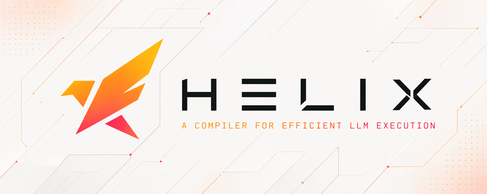

# Helix

Helix is a computation-aware execution optimizer for LLM agent workflows. It wraps YAML-defined workflows, records deterministic context hashes, and reuses safe prior computations through SQLite-backed cache and graph stores.



## Installation

```bash
pip install -e ".[dev]"
```

For real API benchmarks, install provider extras and set at least one API key:

```bash
pip install -e ".[all]"
export OPENAI_API_KEY=...
export ANTHROPIC_API_KEY=...
```

## Quickstart

```bash
helix baseline workflows/demo_chain.yaml
helix run workflows/demo_chain.yaml
helix run workflows/demo_kv_overlap.yaml --verbose
helix bench workflows/demo_chain.yaml
python benchmarks/run_kv_overlap.py
python benchmarks/run_partial_change.py
```

`baseline` executes every step without reuse. `run` uses the optimizer, checking the response cache first, then the computation graph, then executing the step. `bench` runs baseline and optimized modes and prints attribution for latency, token, and cost savings.

Verbose runs include per-step decisions, short cache keys, input and output token counts, latency, KV prefix-overlap tokens, KV reused fraction, estimated KV time and cost saved, and a human-readable decision reason.

## Modules

| Module | Purpose |
| --- | --- |
| `context_engine` | Typed context decomposition and SHA-256 hashing |
| `cache_engine` | SQLite response cache |
| `graph_engine` | SQLite computation DAG |
| `kv_simulator` | Prefix-overlap savings estimates |
| `execution_optimizer` | Cache, graph, and execute decisions |
| `benchmark_engine` | Baseline vs optimized attribution |
| `api_clients` | Fake, OpenAI, Anthropic, and tool clients |

## v0 Notes

- Package and command names are `helix`.
- Fake backend works without API keys.
- SQLite is the only persistence layer in v0.
- Rich renders CLI output.
- Cache keys are built from fully resolved prompt context and model ID.
- KV simulation estimates block-level prefix overlap between consecutive resolved step contexts. It is an estimate only; v0 does not read provider KV-cache telemetry.
- Cache hits count as context reuse. Graph reuse is attributed separately. KV savings apply only to executed steps.

## Demos

Run the KV-overlap demo:

```bash
helix run workflows/demo_kv_overlap.yaml --verbose
python benchmarks/run_kv_overlap.py
```

The workflow keeps an identical system prompt across steps and changes the user prompt, so full response-cache hits are avoided while the shared prefix produces KV overlap.

Run the partial-change demo:

```bash
python benchmarks/run_partial_change.py
```

It performs four optimized runs: cold input, repeated input, changed input, then repeated changed input. The third run demonstrates partial recomputation by reusing the unchanged style step and recomputing the steps affected by the changed document.

## Real API Benchmarks

Real benchmarks use provider-reported latency and token usage, then estimate cost from model pricing. By default, `--real` uses temporary isolated cache and graph databases so previous local runs cannot inflate savings.

```bash
helix bench workflows/demo_real_repeat.yaml --real
helix bench workflows/demo_real_partial.yaml --real
```

Choose a provider explicitly:

```bash
helix bench workflows/demo_real_repeat.yaml --real --backend openai
helix bench workflows/demo_real_partial.yaml --real --backend anthropic
```

Use persistent or explicit benchmark stores when needed:

```bash
helix bench workflows/demo_real_repeat.yaml --real --isolated
helix bench workflows/demo_real_repeat.yaml --real --cache-path /tmp/helix-cache.db --graph-path /tmp/helix-graph.db
```

If API keys or provider packages are missing, Helix skips real benchmarks with a clear message. OpenAI real mode defaults to `gpt-4o-mini`; Anthropic real mode defaults to `claude-3-haiku-20240307`.

Example output:

```text
=== HELIX EXECUTION REPORT ===

Model: claude-3-haiku-20240307

Latency:
Baseline:   2.14s
Optimized:  0.81s
Saved:      1.33s (62.1%)

Cost:
Baseline:   $0.021000
Optimized:  $0.008000
Saved:      $0.013000 (61.9%)

Tokens:
Baseline:   1850
Optimized:  710
Saved:      1140 (61.6%)

Calls:
Baseline:   5
Optimized:  2
Avoided:    3
```

Metrics:

- API calls avoided: baseline calls minus optimized calls.
- Tokens avoided: baseline input/output tokens minus optimized input/output tokens.
- Cost reduced: provider token pricing applied per step and summed per workflow.
- Cache hits: exact resolved-context response reuse.
- Partial recomputation: steps reused from a warmup run while changed inputs recompute affected downstream steps.
- Steps eliminated: redundant runtime steps skipped by explicit optimization tags.

Pricing changes over time. Helix currently uses published per-million-token rates for `gpt-4o-mini` and Claude Haiku-family models; check provider pricing before large runs. Real benchmarks can incur API charges.

### Context Minimization

Optimized runs audit each step before the API call:

- raw resolved input tokens
- minimized input tokens
- tokens removed by minimization

Steps can opt into field projection and compact structured output:

```yaml
input_projection:
  extract_metadata:
    fields: ["doc_type", "region"]
compact: true
output_format: json
max_output_tokens: 80
```

With projection enabled, `{extract_metadata.output}` resolves to only the selected JSON fields. Cache keys are built from the final minimized resolved messages, so unrelated upstream fields do not invalidate unaffected steps.

Write an auditable artifact:

```bash
helix bench workflows/demo_real_partial.yaml --real --backend openai --isolated --json-out results_real_partial.json
```

If an optimized run is worse than baseline, the CLI prints `WARNING: Optimization regression detected` with token, cost, latency, or call increases.

### Semantic Reuse

Exact cache reuse remains the default. Approximate reuse is opt-in per step:

```yaml
semantic_reuse: true
semantic_threshold: 0.90
```

Helix stores a deterministic local embedding of the minimized step input with the cache entry. On later runs, semantic steps can reuse a prior output when cosine similarity exceeds the threshold. Reports distinguish exact cache hits from semantic cache hits and show the average similarity score.

Run the semantic demo:

```bash
helix bench workflows/demo_semantic_reuse.yaml --real --backend openai --isolated
```

### Structured Output Reliability

For JSON steps, Helix validates provider output before it is cached or projected downstream:

```yaml
output_format: json
required_fields: ["doc_type", "region"]
```

Invalid JSON triggers one repair request with a strict “Return ONLY valid JSON” instruction. If repair fails, the step is marked in metrics without crashing the workflow. Reports include repair attempts and repair success rate.
